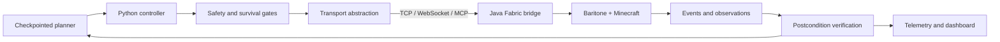

# mcbaratone

**A safety-gated autonomous Minecraft agent built around observable effects, resumable state, and explicit failure boundaries.**

[](https://github.com/jhwodchuck/mcbaratone/actions/workflows/ci.yml)
[](LICENSE)
[](pyproject.toml)
[](bridge/gradle.properties)

`mcbaratone` combines a Python controller, a Java/Fabric bridge, MCP and JSON-RPC interfaces, checkpointed planning, and evidence-driven tests. Its long-term goal is a no-cheat agent that can begin in a real Survival world, establish a sustainable base, reach and defeat the Ender Dragon, and continue into construction and terraforming without player intervention.

The complete spawn-to-endgame mission is **not yet proven**. The repository deliberately distinguishes implemented behavior, offline contract proof, bridge compilation, and observed in-world acceptance.

## Why this project exists

Game automation makes distributed-systems failures unusually visible: a command can be accepted while the world never changes, a retry can duplicate an irreversible action, and a checkpoint can describe state that no longer exists. `mcbaratone` treats those as engineering problems rather than scripting edge cases.

The project emphasizes:

- observed postconditions instead of command-success claims;
- bounded retries and reconciliation for uncertain mutations;
- resumable phase and objective state;
- survival, identity, and world-safety gates;
- transport-independent command and event contracts;
- deterministic offline tests before any live-world exercise;
- telemetry that separates dispatch, bridge response, completion, world effect, and durable progress.

## Architecture



See [Architecture](docs/architecture.md) for the component and evidence boundaries.

## Repository map

| Path | Purpose |
| --- | --- |
| `src/baritone_client/` | Python transports, controller, state machines, safety logic, operations, MCP server, and HTTP API |
| `bridge/` | Java 25 Fabric bridge, command handlers, mutation ledger, event services, and bridge tests |
| `tests/` | Offline unit, contract, state-machine, recovery, and safety tests |
| `tests/functional/` | Explicitly selected live-world harnesses with destructive/read-only classifications |
| `dashboard/` | React/Vite operational dashboard frontend |
| `actions/` | Small reusable action facade |
| `scripts/operations/` | Bounded worker entry points retained as public examples |

## Verification snapshot

The publication candidate was validated on 12 September 2026:

- Python: **2,338 passed, 1 skipped** using the offline-default Pytest configuration;
- secrets: complete retained Git history scanned with Gitleaks 8.30.1, **0 findings**;
- history: **627 commits** retained after removing private operations material;
- live-world tests remain excluded from the default Pytest command.

CI repeats the Python suite on Linux and Windows, builds and tests the Java bridge, and lints/builds the dashboard.

## Quick start: offline development

```bash
python -m venv .venv
```

On Windows:

```powershell
.\.venv\Scripts\python.exe -m pip install -e ".[dev]"
.\.venv\Scripts\python.exe -m pytest -q
```

On Linux or macOS:

```bash
.venv/bin/python -m pip install -e '.[dev]'
.venv/bin/python -m pytest -q
```

The default Pytest configuration excludes tests marked `live_readonly` and `live_mutating`.

## Build the bridge

The bridge targets Minecraft 26.2 and requires Java 25. Its pinned Baritone Fabric API dependency, exact upstream source reference, hash, and LGPL-3.0 notice are documented under [`bridge/libs/`](bridge/libs/README.md).

```powershell
Set-Location bridge
.\gradlew.bat --no-daemon --console=plain build
```

On Linux or macOS, use `./gradlew --no-daemon --console=plain build`.

The bridge has no authentication layer. Keep it on loopback or another explicitly trusted transport; do not expose it directly to the internet.

## Functional-test safety

Functional tests connect to Minecraft and are not interchangeable with offline tests. Some suites teleport players, grant items, alter blocks, or reset disposable worlds. Read the [functional test safety guide](tests/functional/README.md), list the available tests, and select one explicit test ID. Never run an unfiltered live suite against a valued world.

```powershell
.\.venv\Scripts\python.exe tests\functional\run_tests.py --list
```

## Public/private boundary

This public repository intentionally excludes deployment inventories, server addresses, current handoffs, world maps, checkpoints, telemetry captures, family-server configuration, and recovery state. Those are operational data, not source dependencies.

That boundary is part of the design: public core development should remain reproducible without access to a specific server or world.

## Status

Implemented and exercised offline:

- TCP, WebSocket, HTTP, and MCP-facing integration surfaces;
- checkpointed autonomous phases and adaptive scheduling;
- navigation, inventory, crafting, storage, combat, farming, and construction policies;
- postcondition verification and uncertain-mutation reconciliation;
- event correlation, mutation ledger, circuit breaker, and telemetry components;
- React dashboard and Java/Fabric bridge builds.

Still requiring end-to-end evidence:

- a complete organic no-cheat spawn-to-Ender-Dragon run;
- durable post-dragon construction and terraforming over long runtimes;
- recovery across every real-world crash and partial-mutation boundary.

## License and trademarks

First-party source is available under the [MIT License](LICENSE). Bundled third-party components retain their own licenses; see [Third-party notices](THIRD_PARTY_NOTICES.md).

Minecraft is a trademark of Microsoft. Baritone is an independent open-source project. `mcbaratone` is not affiliated with or endorsed by Microsoft, Mojang Studios, or the Baritone maintainers.
